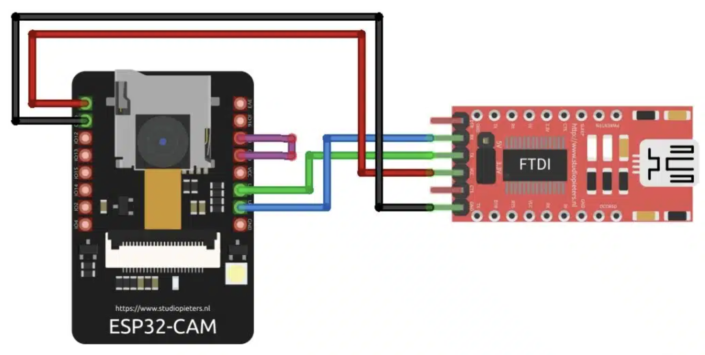

# ESP32 Home Security Camera Telegram Bot

## Hardware

The hardware consistes of:

01 x ESP32-CAM Module with OV2640 2MP Camera
01 x FTDI FT232RL USB Serial Converter Board
01 x 5V 1A Switching Power Supply with USB Input
01 x Mini USB Cable
40 x Female-to-Female Jumper Wires

<!-- markdownlint-disable-next-line MD033 -->

The schematic is as follows:

## Software

Fist, you need to install the Arduino IDE and the ESP32 board support package.
Then, gather the Telegram bot token and WiFi credentials to replace on the code.

### Upload via Arduino IDE

To set Arduino IDE to work with ESP32-CAM, you need to:

- In settings, add this additional board url: <https://dl.espressif.com/dl/package_esp32_index.json>
- Afterwards, go to tools -> Board -> esp32 -> AI Thinker ESP32-CAM
- In boards manager, install "esp32" by "Espressif Systems"
- In library manager, install "UniversalTelegramBot" (v1.3.0)
- Once ESP32 is connected via USB to the computer, select the port: tools -> Port

Now, you need to have the purple wires connected for the ESP32 to enter Flash mode.
Click and hold for 2 seconds the reset button before uploading. Then try to
upload, if something possibly breaks, try to press the reset button while you
see the "Connecting..." message.

Once code is uploaded, remove the purple wires and press the reset button.

### Telegram Bot

- Got to BotFather, use /newbot, grab the bot token to replace on your code.
- Go to @myidbot or another bot that give you your ID. This is meant to be
replaced on your code.

## Code Modules

**PPE16-codigo.ino** - Main Arduino sketch that handles:

- WiFi connection and camera initialization
- Telegram bot integration for remote photo capture
- Motion detection and flash control
- Command processing (/start, Foto, Flash commands)

**app_httpd.cpp** - HTTP server implementation providing:

- Web interface for camera control (port 80)
- MJPEG video streaming endpoint (port 81)
- Camera settings control API
- Single photo capture endpoint

**camera_index.h** - Web interface assets:

- Contains the HTML/CSS/JavaScript for the camera control web page
- Served as gzipped content for efficiency

**camera_pins.h** - Hardware pin definitions:

- GPIO pin mappings for different ESP32-CAM board models
- Supports AI-THINKER, WROVER, M5STACK, and other variants
